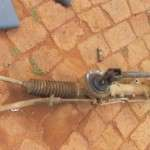

# Detect Image Quality

The goal is to detect if an image (or group of images) is blurry or has low contrast and store the result in a json file

```bash
# Example usage (natively): 
$ pip install -r requirements.txt
$ python batch.py -i parts_vehicles/ -s results.json -f
$ python batch.py -i few_images/ -s results_small.json -f
```

```bash
# Example usage (in docker): 
$ sudo service docker restart
$ jupyter-repo2docker https://github.com/AndreasMerentitis/detect-contrast-blurriness
```

After this step copy the link that will be produced to your web browser and run the example from there

# Extending and reusing the basic idea from these sources:
* https://www.pyimagesearch.com/2015/09/07/blur-detection-with-opencv/
* https://github.com/WillBrennan/BlurDetection2 
* http://scikit-image.org/docs/dev/api/skimage.exposure.html


# Example output from json


```json
{
    "input_dir": "few_images/",
    "results": [
        {
            "blurry": true,
            "clearness_score": 1.249282523178281,
            "contrast_score": 0.1591137254901961,
            "input_path": "few_images/96201_0.png",
            "low_contrast": true
        },
        {
            "blurry": true,
            "clearness_score": 0.5864822106149936,
            "contrast_score": 0.22583392156862747,
            "input_path": "few_images/54575_0.png",
            "low_contrast": false
        },
        {
            "blurry": true,
            "clearness_score": 2.089412541253312,
            "contrast_score": 0.41052254901960783,
            "input_path": "few_images/5346_0.png",
            "low_contrast": false
        },
        {
            "blurry": false,
            "clearness_score": 82.57983014623107,
            "contrast_score": 0.4271205882352942,
            "input_path": "few_images/37088_0.png",
            "low_contrast": false
        },
        {
            "blurry": false,
            "clearness_score": 10.196974843081705,
            "contrast_score": 0.35345693921568677,
            "input_path": "few_images/29017_1.png",
            "low_contrast": false
        },
        {
            "blurry": true,
            "clearness_score": 0.8788307786605958,
            "contrast_score": 0.27411588235294115,
            "input_path": "few_images/32947_0.png",
            "low_contrast": false
        }
    ],
    "threshold": 5.0
}
```

The same files in which the json output (shown above) is calculated are presented here.
It is clear that we have three blurry and two sharp images, as indicated also in the json file. 





